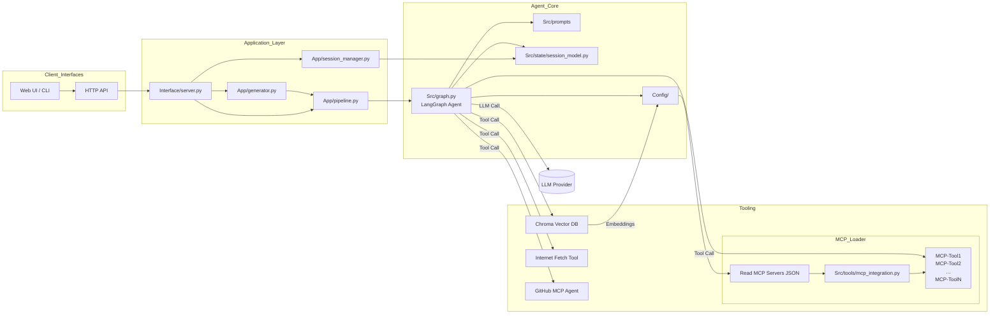

## Architecture

```mermaid

   flowchart LR

%% ===========================
%% CLIENT INTERFACES
%% ===========================
subgraph Client_Interfaces
    UI[Web UI / CLI]
    API[HTTP API]
end

%% ===========================
%% APPLICATION LAYER
%% ===========================
subgraph Application_Layer
    Server[Interface/server.py]
    ResponseGen[App/generator.py]
    PipelineRunner[App/pipeline.py]
    Sessions[App/session_manager.py]
end

%% ===========================
%% AGENT CORE
%% ===========================
subgraph Agent_Core
    Graph[Src/graph.py<br/>LangGraph Agent]
    Prompts[Src/prompts]
    Configs[Config/]
    SessionModel[Src/state/session_model.py]
end

%% ===========================
%% TOOLING LAYER
%% ===========================
subgraph Tooling
    VectorDB[Chroma Vector DB]
    WebFetcher[Internet Fetch Tool]
    GitHubMCP[GitHub MCP Agent]

    subgraph MCP_Loader
        ConfigRead[Read MCP Servers JSON]
        MCPIntegration[Src/tools/mcp_integration.py]
        MCPTools[MCP-Tool1<br/>MCP-Tool2<br/>…<br/>MCP-ToolN]
    end
end

%% ===========================
%% WORKFLOW WIRES
%% ===========================
UI --> API --> Server
Server --> ResponseGen
Server --> PipelineRunner
Server --> Sessions

ResponseGen --> PipelineRunner
PipelineRunner --> Graph
Sessions --> SessionModel

Configs --> ConfigRead --> MCPIntegration --> MCPTools

Graph --> Prompts
Graph --> Configs
Graph --> SessionModel

Graph -->|LLM Call| LLMProvider[(LLM Provider)]

Graph -->|Tool Call| VectorDB
Graph -->|Tool Call| WebFetcher
Graph -->|Tool Call| GitHubMCP

%% ===========================
%% CLEAN DIRECT MCP TOOL CALL
%% ===========================
Graph -->|Tool Call| MCPTools

VectorDB -->|Embeddings| Configs
```

## Data Flow
