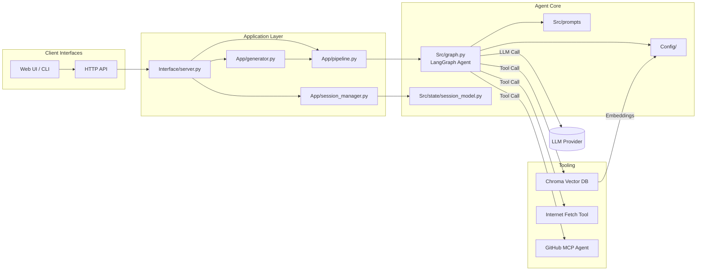

## Architecture

```mermaid
flowchart LR
    subgraph Client Interfaces
        UI[Web UI / CLI]
        API[HTTP API]
    end

  subgraph Application Layer
    Server[Interface/server.py]
    ResponseGen[App/generator.py]
    PipelineRunner[App/pipeline.py]
    Sessions[App/session_manager.py]
    end

    subgraph Agent Core
        Graph[Src/graph.py<br/>LangGraph Agent]
        Prompts[Src/prompts]
        Configs[Config/]
        SessionModel[Src/state/session_model.py]
    end

    subgraph Tooling
        VectorDB[Chroma Vector DB]
        WebFetcher[Internet Fetch Tool]
        GitHubMCP[GitHub MCP Agent]
    end

  UI --> API --> Server
  Server --> ResponseGen
  Server --> PipelineRunner
  Server --> Sessions
  ResponseGen --> PipelineRunner
  PipelineRunner --> Graph
  Sessions --> SessionModel
    Graph --> Prompts
    Graph --> Configs
    Graph -->|LLM Call| LLM[(LLM Provider)]
    Graph -->|Tool Call| VectorDB
    Graph -->|Tool Call| WebFetcher
    Graph -->|Tool Call| GitHubMCP
    VectorDB -->|Embeddings| Configs
```

## Data Flow
